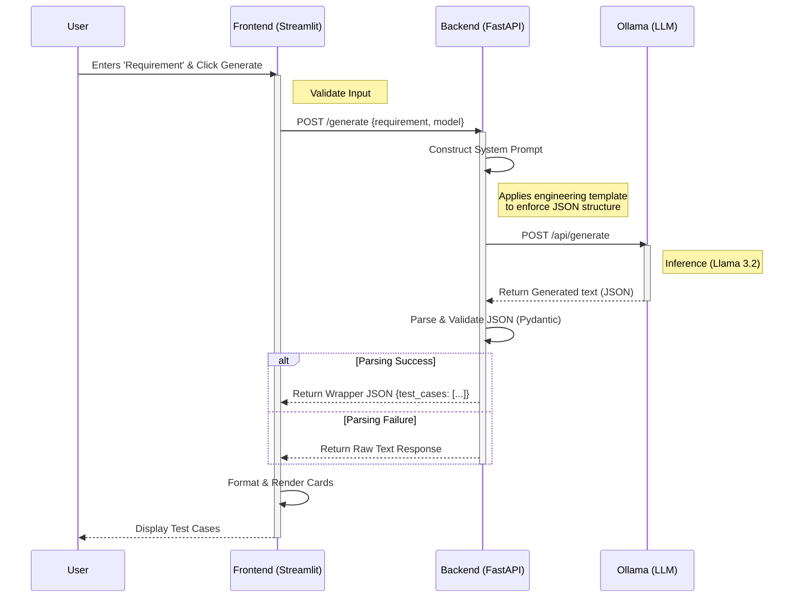

# System Architecture

## Overview

The **Local LLM Test Case Generator** is designed as a decoupled web application where the frontend and backend are separate services. This separation allows for better scalability, easier maintenance, and the flexibility to swap components (e.g., changing the frontend framework) without affecting the core logic.

## 🏗️ Architectural Pattern

The application follows a **Client-Server-AI** pattern:

1.  **Presentation Layer (Frontend)**: Handles user interaction and displays results.
2.  **Application Layer (Backend)**: Manages business logic, prompts engineering, and data validation.
3.  **Intelligence Layer (AI Engine)**: The local LLM providers the generative capabilities.

## 🖼️ Architecture Diagrams

### 1. High-Level Component Diagram

This diagram shows how the different modules interact with each other.

```mermaid
graph TD
    subgraph Client_Side
        Browser[Web Browser]
    end

    subgraph Application_Server ["Host Machine"]
        subgraph Frontend_Service ["Frontend (Streamlit)"]
            UI[User Interface]
            State[Session State]
            ReqHandler[Request Handler]
        end

        subgraph Backend_Service ["Backend (FastAPI)"]
            API[API Endpoint /generate]
            Model[Pydantic Models]
            PromptEng[Prompt Engineer]
            HttpClient[Async HTTP Client]
        end

        subgraph AI_Service ["Ollama Service"]
            LLM[LLM (Llama 3.2)]
            API_Ollama[Ollama API]
        end
    end

    Browser <-->|User Interaction| UI
    ReqHandler <-->|HTTP POST JSON| API
    API --> Model
    Model --> PromptEng
    PromptEng --> HttpClient
    HttpClient <-->|HTTP POST| API_Ollama
    API_Ollama --> LLM
```

### 2. Sequence Diagram

This diagram illustrates the step-by-step flow of data from the user input to the final generated test cases.



## 🧩 Component Details

### Frontend (Streamlit)
*   **Role**: Acts as the dashboard for the user.
*   **Key Responsibilities**:
    *   Capture user input (Requirement text).
    *   Send asynchronous requests to the backend.
    *   Parse the structured JSON response.
    *   Render test cases as interactive UI cards.
*   **Location**: `frontend/app.py`

### Backend (FastAPI)
*   **Role**: The brain of the application.
*   **Key Responsibilities**:
    *   **Prompt Engineering**: Wraps the user input into a strict template that instructs the LLM to output valid JSON.
    *   **API Gateway**: Provides a clean REST API for the frontend.
    *   **Error Handling**: Manages connection errors with Ollama and parsing errors.
*   **Location**: `backend/main.py`

### Ollama (AI Engine)
*   **Role**: The execution engine for the LLM.
*   **Key Responsibilities**:
    *   Host the model locally (`llama3.2`).
    *   Process the prompt and return the continuation text.
*   **Protocol**: HTTP REST API running on port `11434`.

## 💾 Data Flow

1.  **Input**: User Input String (e.g., "User needs a login page...")
2.  **Processing**:
    *   Input is injected into `TEMPLATE` variable in `backend/main.py`.
    *   Template adds instructions: "Generate JSON", "Include id, title, steps..."
3.  **Generation**: LLM generates a string that looks like JSON.
4.  **Validation**: Backend attempts to `json.loads()` the string.
5.  **Output**: Structured Dictionary passed back to Frontend.
